# dmipy-sim

**Diffusion Microstructure Imaging in Python** — the Monte-Carlo **forward** engine. Spins random-walk
through an explicit tissue substrate and accumulate phase under an arbitrary gradient waveform `G(t)`;
the signal is the ensemble mean of the phasors. Wall physics (surface relaxivity, membrane permeability,
magnetization transfer), per-compartment relaxation and susceptibility fields are part of the walk.
Everything is JAX (`vmap`/`scan`) and runs on CPU or a CUDA-12 GPU.

> One `G(t)` and one substrate across the whole loop — **design** the sequence, **simulate** the
> signal, **fit** the tissue:
> **[dmipy-design](https://github.com/dmrai-lab/dmipy-design)** · sequence design &nbsp;·&nbsp;
> **dmipy-sim** · Monte-Carlo forward *(you are here)* &nbsp;·&nbsp;
> **[dmipy-fit](https://github.com/dmrai-lab/dmipy-fit)** · analytical inverse &nbsp;·&nbsp;
> **[dmipy](https://github.com/dmrai-lab/dmipy)** · umbrella + docs at **[dmipy.org](https://dmipy.org)**.

## What this is: a representation, not just a signal

The proposal is a chain of declared, portable objects. A **substrate generator** (CACTUS, CATERPillar, a
DiSCo strand list, the calibrated white matter of `Substrate`, or an analytic geometry) is written down as a
**substrate spec**: where the walls are, which pool is on which side, what each wall does to a spin, where
walkers are seeded. The **engine** walks that spec once and freezes the walk as a **replay pack**: the walk
itself and nothing about how it will be read. Every physical value and every acquisition is then a **replay
knob**: the same pack answers any gradient waveform, any RF schedule, any tissue value, any pose, without
another simulation. Packs tile into a **replay phantom**, where the macroscopic layer lives: fibre
distributions and fractions per voxel, and the maps a scanner adds on top of the microstructure.

```mermaid
flowchart LR
    subgraph gen["substrate generators"]
        direction TB
        G1["CACTUS · CATERPillar · DiSCo strands"]
        G2["Substrate.canonical(...).request(...)"]
        G3["analytic geometries: Cylinder, Sphere, Mesh, ..."]
    end
    SPEC["SubstrateSpec (.sub.json)<br/>domain · pools · walls and their physics<br/>seeding · request vs realisation · nominal values"]
    ENGINE["dmipy-sim engine<br/>walk_spec / simulate<br/>sub-steps from the spec's smallest feature<br/>save grid from the scanner class"]
    RPK["Replay Pack (.rpk)<br/>positions as bridge + K sine bands<br/>occupancy · wall contact · field basis<br/>+ the spec, no tissue value"]
    subgraph knobs["replay knobs"]
        direction TB
        K1["tissue: T2 / T1 per pool · rho · chi · B0 and its direction"]
        K2["acquisition: any G(t) exactly · RF schedule (vector Bloch) · b-tensors · CPMG"]
        K3["pose: orientation · FOD (Gaunt composition)"]
    end
    SIG["signal · any scanner, any sequence"]
    RPH["Replay Phantom (.rph)<br/>packs over a voxel grid · FOD + fractions per voxel<br/>per-voxel maps (B1 transmit); macroscopic B0 /<br/>tissue-interface fields as the assembly layer"]
    gen --> SPEC --> ENGINE --> RPK --> knobs --> SIG
    RPK --> RPH --> knobs
```



The formats are open specifications, versioned together in
[replay-pack-spec](https://github.com/dmrai-lab/replay-pack-spec): `SUBSTRATE.md` (the spec), `RPK.md`
(the pack), `RPH.md` (the phantom). A pack from the substrate bank reproduces its paper by firing a pulse
at it, and the same pack serves a fitting framework, an acquisition designer and a tractography phantom.

## Two ways to get a signal

**Fused**: one call walks the spins under one acquisition and returns the signal.

```python
from dmipy_sim import simulate, Cylinder
from dmipy_sim.sequences import Sequence

seq  = Sequence.from_pgse(bvalues=[0, 1e9, 2e9], gradient_directions=[[1, 0, 0]] * 3,
                          delta=0.01, Delta=0.04)                 # exact G for the requested b
spec = Cylinder(radius=5e-6, orientation=(0, 0, 1)).spec           # the situation, written out: an open box,
spec.save("cylinder.sub.json")                                    #   one lumen pool seeded, a reflecting wall
E    = simulate(n_walkers=100_000, diffusivity=2e-9, waveform=seq, geometry=spec, seed=0)
```

Every driver takes the substrate as a **spec** (`SubstrateSpec`, its dict, or a `.sub.json` path) or as the
geometry object that is one spelling of it; `geometry.spec` writes out what a constructor leaves implicit, and a
substrate with no spec spelling is refused.

**Persistent**: walk once, keep the walk, replay any acquisition on it. The walk records every replay
tier the substrate supports — positions (C0), compartment occupancy for per-pool T2/T1 (C1), the
boundary local time for surface relaxivity (C2), and, through a field grid, the susceptibility field
(C3). A `.rpk` replay pack is the compressed, self-certifying form of that walk; it is what the
substrate bank distributes and what dmipy-fit fits against.

```python
from dmipy_sim.substrate import Substrate
from dmipy_sim.spec import walk_spec
from dmipy_sim.replay import ReplayPack
from dmipy_sim.replay.bank import build_replay_pack
from dmipy_sim.sequences import Sequence

# the substrate: histology-calibrated white matter, realised as a SPEC -- domain, pools, walls, seeding,
# what was requested and what was achieved, all written out (replay-pack-spec/SUBSTRATE.md)
sub  = Substrate.canonical(field_T=3.0)          # diameter law (floored at d_min), g-ratio, f_axon, D, T2, rho, kappa
spec = sub.request(n_fibres=300, seed=0)         # refuses an infeasible packing; records the realised fraction and gaps
spec.save("wm.sub.json")

# 1. walk once, from the spec and nothing else -- positions, occupancy and boundary local time are recorded
walk = walk_spec(spec, 200_000, T_max=0.05, seed=0)            # the save grid is derived (scanner="connectom" by default)

# 2. compress into a pack: channels (positions, occupancy, local time, field basis) and the spec -- not one
#    T2, rho or chi value lives in the pack; those are what a replay applies
pack = build_replay_pack(walk, id="wm/canonical", license="CC-BY-4.0", citation="...")
pack.save("wm.rpk")

# 3. anywhere, later: load it and fire a pulse at it
pack = ReplayPack.load("wm.rpk")
seq  = Sequence.from_pgse(bvalues=[1e9], gradient_directions=[[1, 0, 0]], delta=0.01, Delta=0.03)
E    = pack.replay(seq)                             # the NOMINAL replay: the spec's T2 / T1 per pool, rho,
                                                    # chi and calibration field (3 T here); all four tiers
E2   = pack.replay(seq, B0=7.0, b0_dir=(1, 0, 0))   # any value is a knob: same walk, another scanner
```

The spec the pack embeds carries the substrate's nominal values, so a published pack reproduces its paper
with no second file. `pack.replay(seq, tissue=False)` is the bare diffusion signal; `T2=` per pool id or
`{"intra": 0.05, ...}` by pool name, `rho=`, `B0=`, `chi_iso=`, `chi_aniso=` override one value each;
`tissue=Tissue(...)` supplies a whole set; `compartment=1` restricts the mean to one pool. The pose is a knob
too: `orientation=` takes either **one pose** — a rotation, or the lab direction the substrate axis points
along, exact by pose covariance since the gradient and the field rotate together — or **a distribution of
poses**, which is composed on SO(3). A pose is a rotation and not an axis, so nothing assumes the substrate is
axially symmetric: `pack.pose_response(seq)` expands the response in the real Wigner basis, and
`Distribution.watson(...)` / `.bingham(frame, (k1, k2))` / `.axis(direction)` / `FOD.from_sh(coeffs,
basis="tournier07")` are that expansion's counterpart, so anisotropic dispersion — a fan with two dispersion
parameters — composes as easily as a cone. An orientation distribution over directions alone says nothing about
the substrate's own azimuth, and that azimuth is then integrated away exactly rather than sampled. A bare
coefficient array is refused: the basis must be named. A tier that is requested but not carried
raises; nothing is silently skipped.

## Substrates

All lengths in metres, diffusivities in m²/s, times in seconds. Compartment ids are the same
everywhere: 0 extra-cellular, 1 intra (the lumen / inside a closed surface), 2 myelin.

| family | classes |
|---|---|
| analytic | `FreeDiffusion`, `Box1D`, `Sphere`, `Cylinder`, `Ellipsoid`, `PermeableSlab1D`, `PermeableShell` |
| packed, periodic | `PackedCylinders`, `PackedSpheres`, `PackedMyelinatedCylinders` (+ `pack_*` RSA packers) |
| myelinated | `MyelinatedCylinder`, `PackedMyelinatedCylinders` — three pools, two walls |
| curved fibres | `CurvedCylinder`, `CurvedMyelinatedCylinder`, `PackedCurvedCylinders` — sphere-swept polylines |
| meshes | `Mesh` / `Mesh.from_ply` — any closed or 3-D-periodic triangle mesh, grid-accelerated |
| sphere-grown cells | `SphereUnion` — the outer boundary of a union of overlapping spheres (CATERPillar), no meshing |

Datasets enter as **specs**: `spec.cactus_spec(run_dir)`, `spec.winther_spec(inner, outer)`,
`spec.caterpillar_spec(csv)`, `spec.strands_spec(txt)` / `spec.disco_spec(txt)` read the files and write down
domain, pools, walls and seeding; `walk_spec(spec, ...)` walks them pool by pool and the pack embeds the spec.
The save grid is not a knob: `walk_spec` derives `dt_save` from the strongest waveform a scanner class can
deliver (`scanner="prisma" | "magnus" | "connectom" | ...`, or `(G_max, slew)`), the walker count and `T_max`,
so the replay's in-step phase error stays below a tenth of the walk's own noise floor; pack size is set by K,
not by the grid.

Wall and pool properties are set on the geometry and baked into the walk:

```python
Cylinder(5e-6, (0, 0, 1), surface_relaxivity_t2=1e-6)      # rho (m/s), Brownstein–Tarr at the wall
Cylinder(5e-6, (0, 0, 1), permeability=2e-5)               # kappa (m/s), Powles crossing
Mesh(V, F, pool="extra", compartments=Compartments(extra=Pool(T2=0.08, D=1.7e-9),
                                                   intra=Pool(T2=0.05, D=1.7e-9)))
```

`Compartments` is the one spelling of per-pool D / T2 / T1 / water fraction / side-dependent rho, for
every geometry and for `Substrate`. A `Mesh` also declares which pool a driver seeds (`pool=`) and is
placed in the bore by an acquisition rotation (`orientation=`), so the walk stays in the mesh frame.

### Meshes

```python
from dmipy_sim import Mesh
mesh = Mesh.from_ply("substrate.ply", scale=1e-5, periodic=True,
                     voxel_min=[-10e-6] * 3, voxel_max=[10e-6] * 3, feature_radius=1.7e-6)
mesh.quality_report()          # per-effect resolution verdict; permeability needs edge/feature <~ 0.04
```

Per step a walker tests only the triangles in its 27-cell neighbourhood, so a 10⁶-triangle mesh is
tractable. Reflection uses smooth vertex normals; permeation is one Powles decision at the first hit
and then a multi-bounce reflection; the voxel faces are periodic wrap planes or specular walls, never
teleports. Loading needs `pip install "dmipy-sim[mesh]"`.

## Acquisitions

`G(t)` of shape `(n_measurements, n_t, 3)` is the base representation. `Sequence.from_pgse` /
`from_cpmg` / … compute the exact gradient for requested b-values and refuse infeasible requests; the
lower-level `pgse`, `pgste`, `ogse`, `cpmg`, `ste`, `pte` constructors build the waveform from
hardware amplitudes. The RF schedule (`rf_events`) is the source of a waveform's coherence attributes:
`chi_perp`, `TM`, `stimulated_echo` and `echo_indices` are derived from it, never carried as flags.
B-tensor encoding (LTE / PTE / STE) and multi-echo CPMG are included. The vector-Bloch engine
(`simulate_bloch`) propagates M = (Mx, My, Mz) through the actual RF, gradient, relaxation, exchange
and MT operators when the transverse-only picture is not enough.

## Physics is the specification

Correctness is defined by the test suite: analytical solutions, eigenfunction series, Brownstein–Tarr
relations, exchange laws and MISST reference signals. Every parameter the engine tunes for speed
(bounce budgets, sub-steps, grid cells) is derived from the most adversarial situation a walker can
meet in that substrate, not validated on an average case.

## Layout

```
dmipy_sim/
  geometry/     substrates: base, analytic, packed, myelin, packing, curved_cylinder, mesh, mesh_shapes
  engine/       core (simulate, simulate_trajectories), physics, bloch, pulse_sequence, mt, mt_walk, gpu
  replay/       trajectories, compression, replay (ReplayPack), bank (build_replay_pack)
  acquisition/  waveforms, rf, noise          sequences/   Sequence, pulseq import/export
  fields/       susceptibility, susceptibility_field (FieldGrid, field_grid_of)
  substrate/    Substrate (calibrated white matter), biophysical constants
  compartments.py  persistent_walk.py  constants.py   viz/  io/  math/
```

`CLAUDE.md` is the operational guide for agents and contributors: the geometry contract, the step
rules, the replay invariant, and how to add physics.

## Examples

- **[Canonical white matter](examples/canonical_wm_flagship.ipynb)** — the calibrated packed-myelinated
  substrate, forward signal with surface relaxivity, parity with dmipy-fit's analytical model.
- **[Mesh loading and visualisation](examples/mesh_ply_and_viz.ipynb)** — build or load a mesh, run
  diffusion, relaxivity and permeability, select permeated walkers, render the viewer.
- **[Validation ladders](examples/validation/)** — surface relaxivity and permeability from 1-D to 3-D
  against exact eigenvalues; extra-axonal tortuosity scale sweep.
- **[Substrate bank](examples/substrate_bank/)** — building canonical-pore packs with a fidelity target.

## Install

```bash
pip install -e ".[dev]" && pip install "jax[cpu]>=0.6.2"     # CPU, any platform
pip install -e ".[cuda12,dev]"                                # NVIDIA GPU, CUDA 12
```

On a GPU box, point the loader at the bundled CUDA libraries once in your venv's `activate`:

```bash
export LD_LIBRARY_PATH=$(find "$VIRTUAL_ENV/lib"/python*/site-packages/nvidia -name lib -type d | tr '\n' ':')$LD_LIBRARY_PATH
```

Large runs belong on the GPU in float32; `simulate` warns on a large CPU run unless `require_gpu=False`.

## Tests

```bash
JAX_PLATFORMS=cpu pytest tests/ -q -m "not slow and not gpu"   # fast tier: every PR (~7 min on a GPU)
pytest -q -m slow                                              # heavy statistical MC validation
```

`tests/geometry/` mirrors the geometry package; `tests/physics/` and `tests/validation/` assert
physics across modules.

## License

Dual-licensed: **GNU AGPL-3.0** for open-source use, or a **commercial license** for proprietary use.
See [LICENSE](LICENSE) and [LICENSING.md](LICENSING.md).
