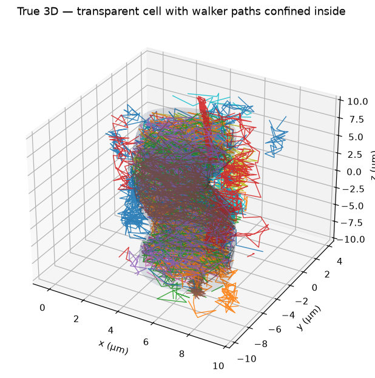
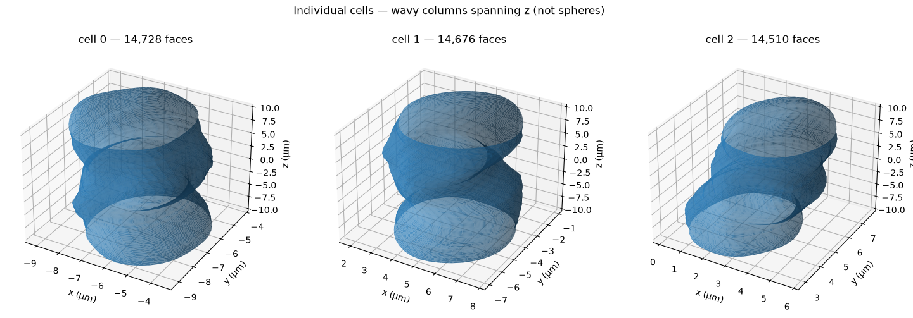
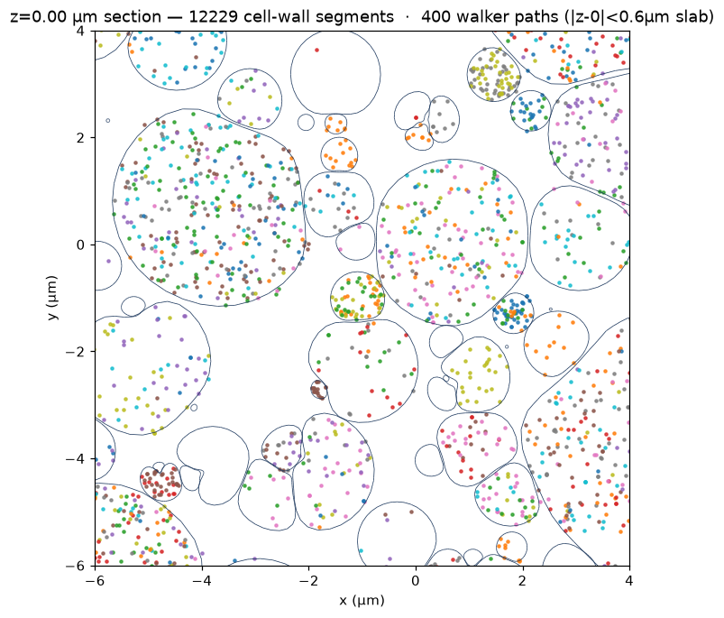

# Mesh substrate visualisation

Observability helpers for the `Mesh` geometry (`dmipy_sim.viz`), shown on a dense
multi-cell PLY substrate (~1.2M triangles, 169 cells, 3D-periodic). The mesh file
itself is **not** committed — bring your own with `Mesh.from_ply(...)`.

## True 3D — confined diffusion in one cell

A single cell drawn as a transparent surface with reflecting-walk paths inside it.
This is the honest confinement view for a 3D substrate: no plane slice, no
projection. Each walker stays inside its cell.




The cells are **wavy columns spanning z** (beaded / varicose fibre-like), not
isolated spheres — something a single flat slice hides but the 3D view makes
obvious.



## Cross-section (slice inspector)

`plot_mesh_section` draws every cell wall on a plane (a robust triangle–plane
slice) with walkers overlaid. Use it to inspect the geometry **at a plane** — the
size distribution, or a deliberate pore/defect at a given z — or for substrates
that are invariant along the slice axis. It is a geometry probe, not a
confinement view for a 3D substrate.


Walker paths overlaid on a section are wrapped into the periodic box and filtered
to a thin slab about the plane, so what is shown genuinely lies in that slice and
inside the cells:



## Compartments

`init_positions(intra=…)` seeds inside or outside the cells; here the intra/extra
split matches the ~0.6 volume fraction.


## Reproduce

```python
import jax
from dmipy_sim import (Mesh, plot_mesh_3d, seed_in_cell, walk_paths,
                       plot_mesh_section, plot_trajectories, save_rotation)
from dmipy_sim.viz import _split_cells

# load your mesh, scaling normalised coords -> metres, as a 3D-periodic pack
mesh = Mesh.from_ply("substrate.ply", scale=1e-5, periodic=True,
                     voxel_min=[-10e-6]*3, voxel_max=[10e-6]*3, feature_radius=1.68e-6)

# true-3D: paths confined inside one interior cell
cell = _split_cells(mesh)[1]
seeds = seed_in_cell(cell, 16)
paths = walk_paths(mesh, 16, 500, diffusivity=2e-9, dt=2e-4, r0=seeds)
ax = plot_mesh_3d(mesh, cells=(1,), paths=paths)
save_rotation(ax, "mesh_3d_spin.gif")           # animated GIF

# slice inspector
plot_mesh_section(mesh, axis="z", offset=0.0,
                  walkers=mesh.init_positions(4000, jax.random.PRNGKey(0)))
```

Needs the optional `mesh` + plotting extras: `pip install dmipy-sim[mesh,dev]`.
Trajectories here are a plain reflecting walk (diffusion only) — trajectory
*export*, distinct from the signal-simulation path.
